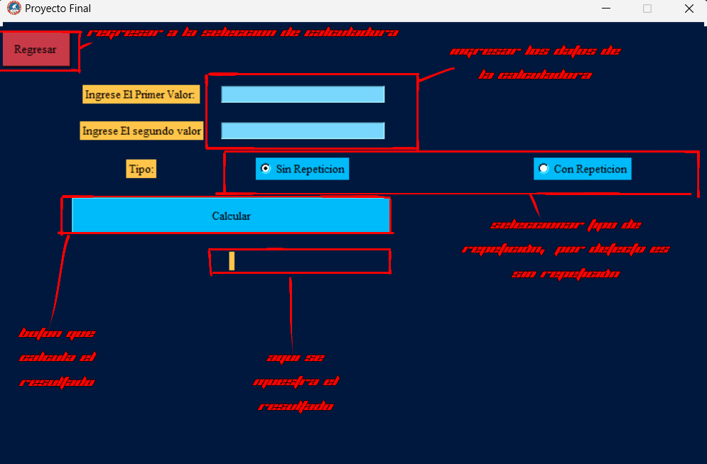

# **Proyecto Final**

## **Diccionario de Datos**

Puedes ver [aqui](./Diccionario_de_datos.md) el listado completo con las variables y funciones utilizadas

## **Pagina Principal**

### Objetivo
El objetivo es dar acceso a las multiples calculadoras disponibles en el presente proyecto ademas de la navegacion entre los integrantes los cuales fueron participantes en la elaboracion de las calculadoras finalmente una forma dinamica de cerrar la ventana al dejar de usar la aplicacion
  
### Que hace
Permite el libre acceso a las pantallas en las cuales estan disponibles las calculadoras ademas de dar una vista y una disposicion amigable al usuario.
  
### Como se hace
Haciendo clic en los 3 posibles botones que redireccionaran a las pantallas disponibles en el proyecto una vez terminadas de usar las calculadoras disponibles tiene la libertar de cerrar el programa presionando el boton rojo en la parte inferior del programa.
  
## **Calculadora de combinaciones y permutaciones**

### Objetivo
Realizar las operaciones seleccionables, ya sea permutaciones y conmutaciones, al igual que puedes
elegir el tipo de repeticiones se realizan

### Que hace
Calcula la cantidad de combinaciones y permutaciones, con formulas internas mostrando la 
cantidad de estas mismas que se pueden realizar

### Como se hace
1)Seleccionar la Operación
2)Introducir los valores en las 2 entradas
3)Seleccionar el tipo de repetición (Sin Repetición) esta por Defecto
4)Presionar el botón Calcular y ver el resultado y con que formula se llego al mismo

## **Calculadora de algebra lineal**

### Objetivo

Con esta calculadora Se pueden realizar

### Que hace

### Como se hace